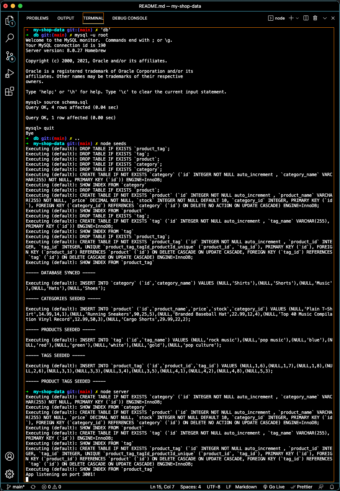
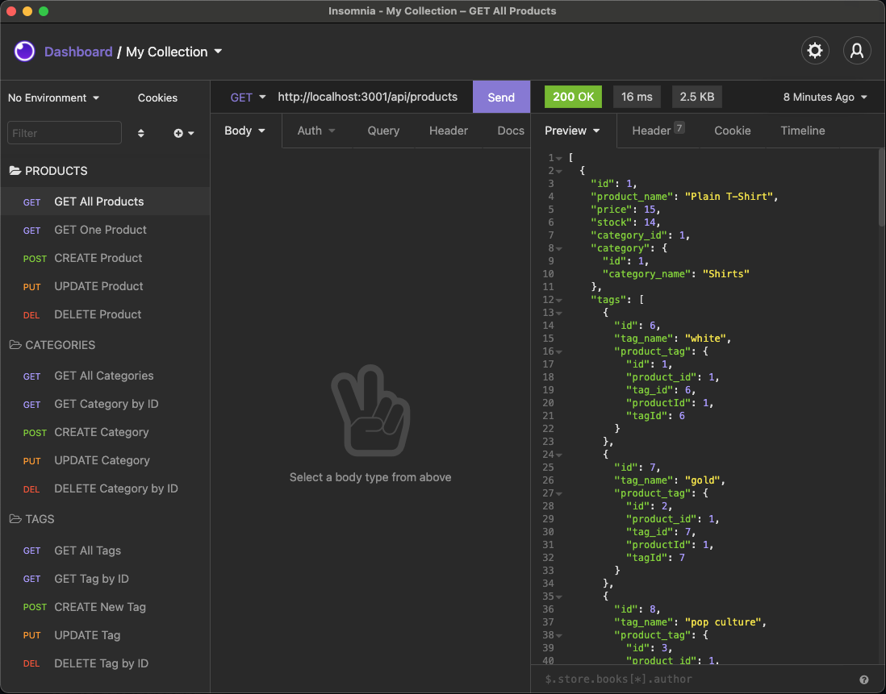

# my-shop-data

<br />

## Table of Contents

- [Description](#description)
- [User Story](#user-story)
- [Installation](#installation)
- [Testing](#testing)
- [License](#license)
- [Demo](#demo)
- [Criteria](#criteria)
- [Collaboration](#collaboration)

<br />
<br />

## Description

My Shop Data is an e-Comm back end application used to manage the mySQL database of products in a web shop.

<br />
<br />

## User Story

```
AS A manager at an internet retail company
I WANT a back end for my e-commerce website that uses the latest technologies
SO THAT my company can compete with other e-commerce companies
```

<br />

## Installation

Must first launch mySQL server with the following commands: ⬇️

```
cd 'db'
mysql -u root
source schema.sql
quit
..
node seeds
```

<br />

Application will then run in the command-line with:

```
node server
```

<br />

Employing the following technology:

[](https://expressjs.com/en/guide/routing.html#response-methods) [](https://www.npmjs.com/package/sequelize) [](https://www.npmjs.com/package/mysql2) [](https://www.npmjs.com/package/dotenv)

[](https://insomnia.rest/products/insomnia) [](https://nodejs.org/en/docs/) [](https://www.npmjs.com/)

<br />
<br />

## Testing

[](https://insomnia.rest/products/insomnia)

<br />
<br />

## License

Copyright (c) David Dyer [2021]

[](https://choosealicense.com/licenses/isc/)

<br />

## Demo

[](https://youtu.be/NRFGfxo9_p4)




<br />
<br />

## Criteria

✅

```
With Express API, this command-line application connects to mySQL database using Sequelize.

After schema & seeds commands, database environment created with test data.

Init prompt launches server, models sync to database.

When opening API GET routes in Insomnia Core for categories, products,
or tags, the data for each route is displayed in formatted JSON.

When testing API POST, PUT, and DELETE routes in Insomnia Core, I am able
to successfully create, update, and delete data in the database.

```

<br />
<br />

## Collaboration

Development efforts most often include guidance from Jedi Master:  
**Chris Champness**

<a href= "https://github.com/CChampness"></a>

<br />

**Reporting Issues**:
Please contact [djdyer](https://www.github.com/djdyer) to report any bugs.

**Contributions**:
Clone branch, submit pull request for review after completing any improvements.

<br />
<br />
Thanks for taking a look!

🤓
